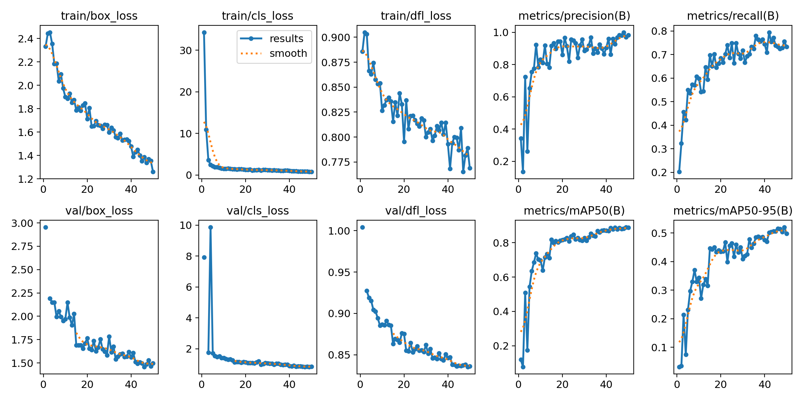
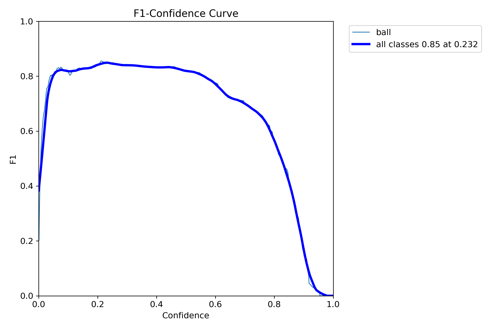

# ⚽ Football Ball Detection

This project is a computer vision system for detecting the football (soccer ball) in images and videos using deep learning. The model was trained on a custom dataset of annotated match frames, and works for both still images and video sequences.

## 📦 Dataset

The dataset used for training and evaluation was sourced from Roboflow and includes annotated footballs in match environments:

- **Roboflow Dataset Link**:  
  [Football Ball Detection Dataset (v4) – Roboflow](https://universe.roboflow.com/roboflow-jvuqo/football-ball-detection-rejhg/dataset/4)

The dataset includes:
- High-resolution annotated match frames
- Bounding boxes around footballs
- Training/Validation/Test split

## 🚀 Features

- 🎯 **Accurate football detection** in real-time videos or static images
- 📸 **Supports image evaluation**
- 🎥 **Video input support**
- 📊 **Evaluation results with example detections**
- 🤖 Built using **YOLO / TensorFlow / PyTorch** (depending on implementation)

## 📹 Demo Video

Watch a demonstration of the system detecting footballs in a real match video:

👉 **[Watch Demo on Google Drive](https://drive.google.com/your_demo_video_link_here](https://drive.google.com/drive/folders/1rcgV6Bs9FpbKMKBDa1J7xDDdSyORVf0H?usp=drive_link)**  

## 📈 Evaluation
The model was evaluated using mean average precision (mAP) and Intersection over Union (IoU) scores on the test set from Roboflow. Results and charts are available in the evaluation/ folder.

### Results
<p align="center">
  
</p>

### F1-curve
<p align="center">
  
</p>

## 🛠️ Installation & Usage

### 1. Clone the Repository

```bash
git clone https://github.com/yourusername/football-ball-detection.git
cd football-ball-detection
```


